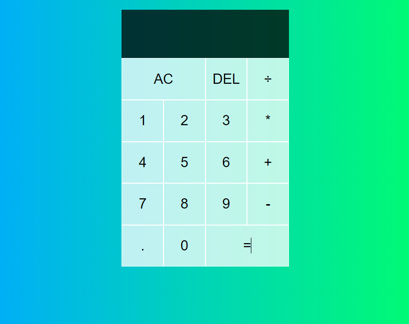

<h1>React.js Calculator Application </h1>

A simple calculator application built with React.js

# Getting Started

These instructions will get you a copy of the project up and running on your local machine for development and testing purposes.
# Prerequisites

    Node.js
    NPM or Yarn

# Installing

    Clone the repository to your local machine

bash

git clone https://github.com/night780/React.js-Calculator.git

    Install the dependencies

bash

cd React.js-Calculator
npm install

or

bash

cd React.js-Calculator
yarn

    Start the development server

sql

npm start

or

sql

yarn start

    Open your web browser and go to http://localhost:3000

# Built With

    React.js
    Create React App

# Author

    night780

